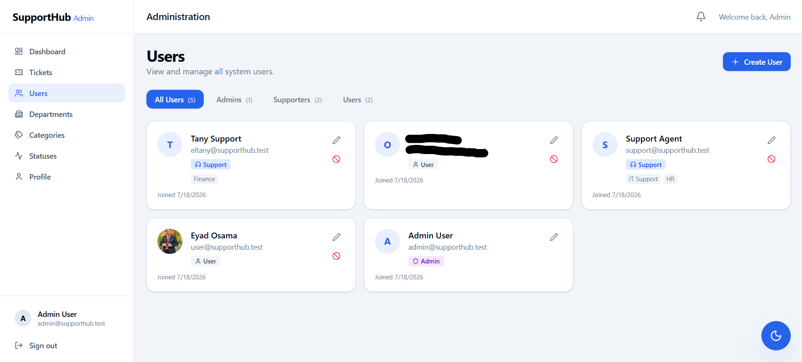
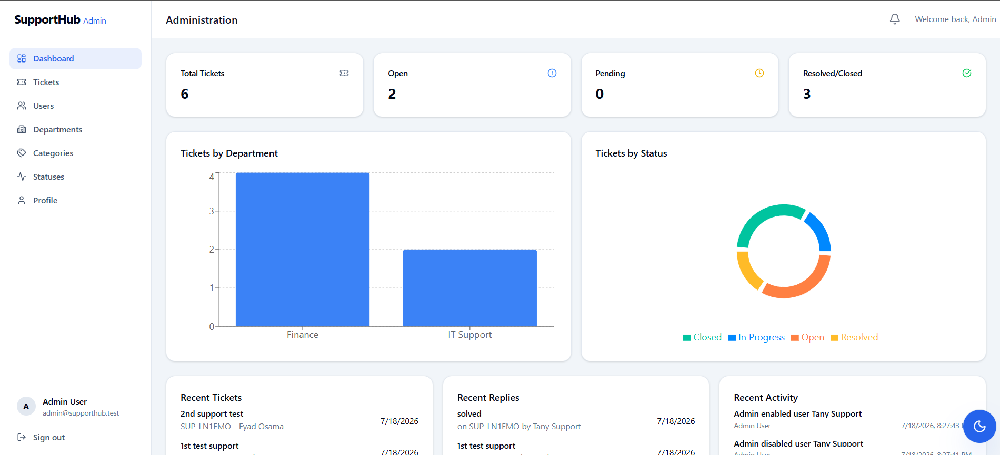
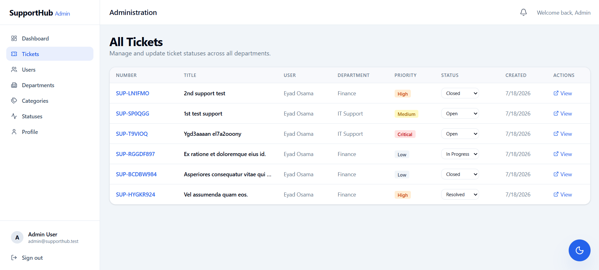
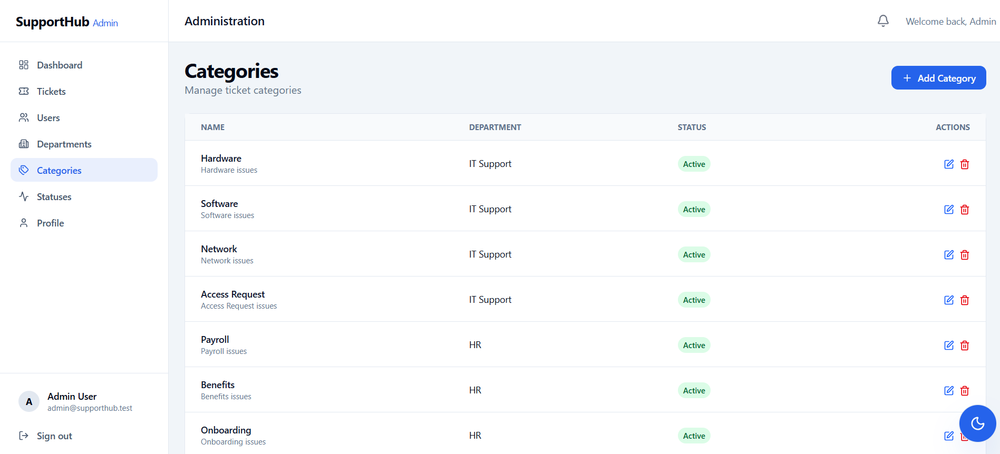
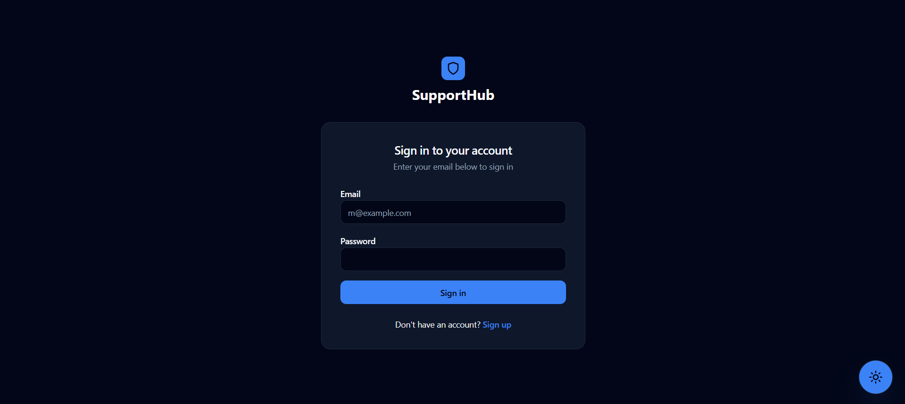
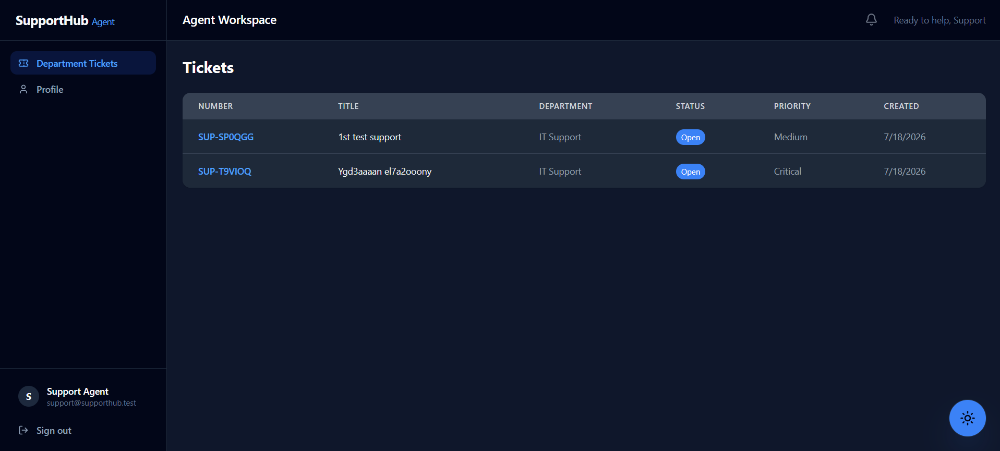
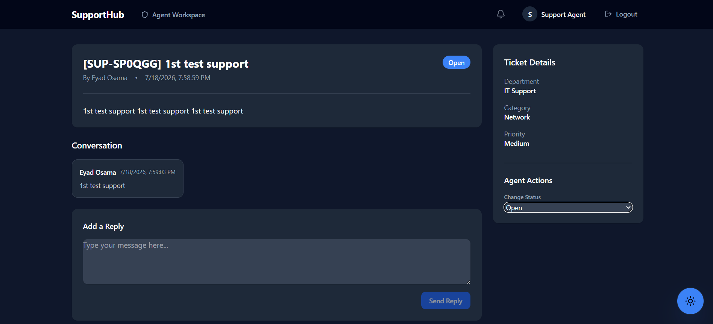
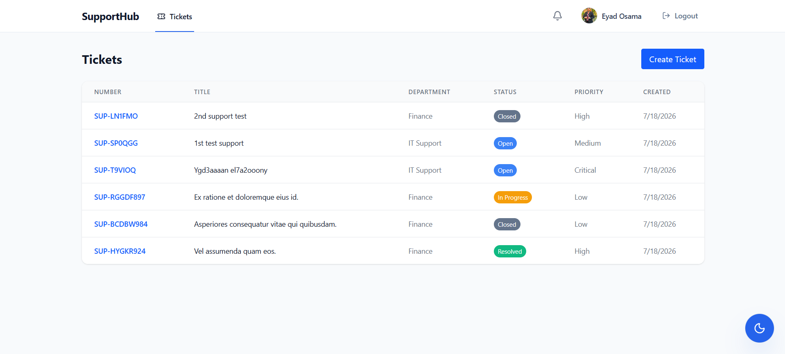
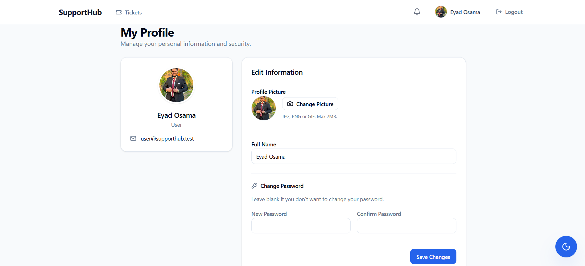

# SupportHub 🚀

SupportHub is a robust, production-ready Help Desk and Ticket Management system built with **Laravel 11** and **React (Vite)**. It provides a secure, role-based platform for users to submit support requests, support agents to resolve them, and administrators to oversee the entire system.

## 📸 Screenshots

### Admin Dashboard & Configurations






### Authentication



### Agent Workspace (Support)




### User Portal




---

## 🌟 Key Features

- **Role-Based Access Control (RBAC):** Granular permissions for Users, Support Agents, and Administrators using `spatie/laravel-permission`.
- **Tenant/Department Isolation:** Support agents can be dynamically assigned to specific departments and only see tickets relevant to their expertise. Users can only ever see their own tickets.
- **Ticket Lifecycle Management:** Create, assign, transfer, and resolve tickets with strict status transition rules.
- **Real-time Activity Logging:** Every business action (role changes, ticket assignments, status updates) is securely tracked using `spatie/laravel-activitylog` and displayed in the Admin Dashboard.
- **Soft Deletes & Security:** Administrators can soft-delete user accounts to disable logins without destroying historical ticket data.
- **Dark Mode UI:** A gorgeous, fully responsive React interface built with Tailwind CSS and `shadcn/ui` components that respects system light/dark mode preferences.
- **Database Notifications:** Users and Agents receive built-in notifications when tickets are replied to or updated.

---

## 🛠️ Tech Stack

### Backend (API)

- **Framework:** Laravel 11 (PHP 8.2+)
- **Database:** MySQL 8.4
- **Authentication:** Laravel Sanctum (Stateful SPA Cookies)
- **Permissions:** Spatie Laravel Permission
- **Auditing:** Spatie Activity Log

### Frontend (SPA)

- **Framework:** React 18 + Vite
- **State Management:** Redux Toolkit
- **Routing:** React Router v6
- **Styling:** Tailwind CSS + shadcn/ui
- **API Client:** Axios
- **Forms:** React Hook Form + Zod validation
- **Charts:** Recharts

---

## ⚙️ Local Setup Guide

You can run SupportHub locally using either **Laragon** (native Windows) or **Docker** (isolated containers).

### Option 1: Docker (Recommended)

Docker will instantly spin up Nginx, PHP-FPM, MySQL, and the React frontend in isolated containers.

1. Install [Docker Desktop](https://docs.docker.com/desktop/).
2. Clone the repository and navigate to the project root.
3. Start the containers:
    ```bash
    docker compose up -d --build
    ```
4. Run the database migrations and seeders inside the backend container:
    ```bash
    docker compose exec backend php artisan migrate:fresh --seed
    ```
5. Access the application:
    - **Frontend:** `http://localhost:5173`
    - **Backend API:** `http://localhost:8000/api`

### Option 2: Laragon / Local Server

1. Clone the repository into your `www` folder.
2. Setup the **Backend**:
    ```bash
    cd backend
    composer install
    cp .env.example .env
    php artisan key:generate
    php artisan storage:link
    ```
3. **Create a MySQL database** named `supporthub` (via phpMyAdmin, HeidiSQL, or the command line):
    ```sql
    CREATE DATABASE supporthub;
    ```
4. Update your `.env` file with the correct database credentials:
    ```env
    DB_DATABASE=supporthub
    DB_USERNAME=root
    DB_PASSWORD=
    ```
5. Run the migrations and seeders to initialize the database with tables and demo data:
    ```bash
    php artisan migrate:fresh --seed
    ```
6. Setup the **Frontend**:
    ```bash
    cd ../frontend
    npm install
    npm run dev
    ```

---

## 🔑 Default Demo Accounts

If you ran the seeders (`php artisan db:seed`), you can log in with the following accounts:

- **Admin:** `admin@example.com` / `password`
- **Support Agent:** `support@example.com` / `password`
- **Standard User:** `user@example.com` / `password`

---

## 📚 API Documentation

A full API reference is available in the [API_DOCUMENTATION.md](API_DOCUMENTATION.md) file.

## 🧪 Testing

The backend includes automated feature tests to verify core security and business logic. To run the test suite:

```bash
cd backend
php artisan test
```

---
